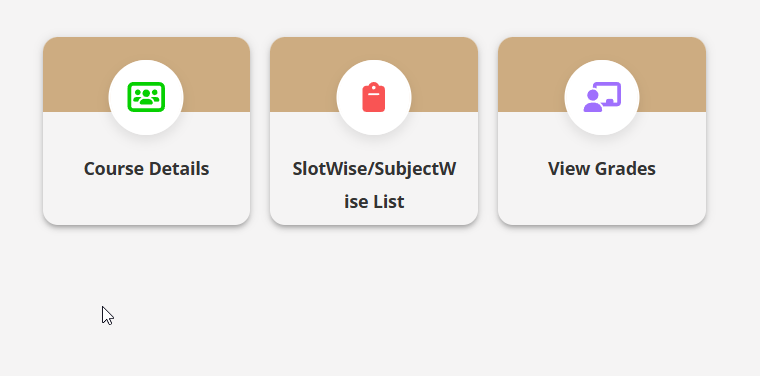

<!-- @format -->

Help me create an engineering portfolio website. The current styling looks good. Create a new page for projects. Now this is how I want the Projects page to work like:

1. Every project exists as a square tab like this(adjust dimensions). An image, the title, and a brief about the project
2. Pressing each tab opens info in a floating information box(not in a new tab)
   Where do you get the projects from?
   Create a directory `res/projects`. The structure is as follows
   res
   └── projects
   ├── 01_Project1
   │ ├── Brief_Img.png
   │ ├── Details.md
   │ ├── init.md
   │ └── res
   └── Display.md

The `Display.md` file contains the list of project folders to display, in order. Example: `Display order - 01_Project1, 02_Project2`.
Each project folder (e.g., `01_Project1`) must contain:

- `init.md`: Key-value pairs for Title, Image, Brief, and Details file.
- `Details.md`: Markdown content for the project details modal.
- `Brief_Img.png`: Thumbnail image.

If any asset is missing, the code should skip it silently.
Use the display.md file for getting info on how to display projects on the page.
